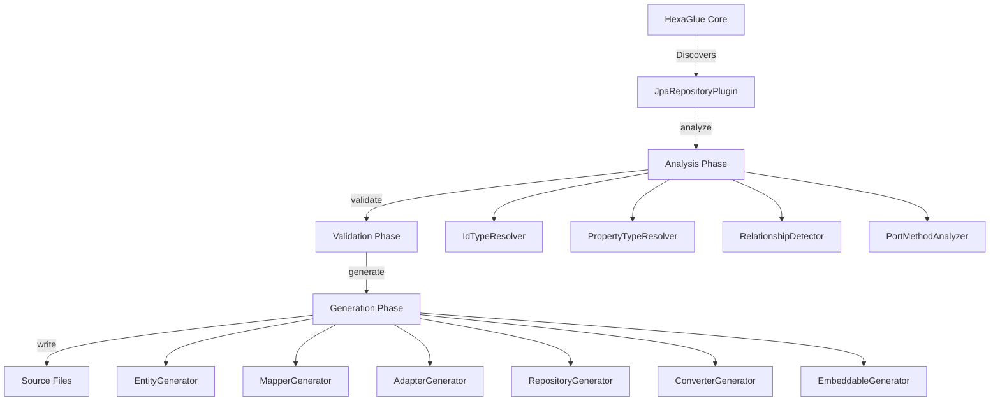

# HexaGlue JPA Plugin - Architecture

> Internal architecture and design decisions for plugin developers and contributors.

## Table of Contents

1. [Overview](#overview)
2. [Plugin Lifecycle](#plugin-lifecycle)
3. [Module Structure](#module-structure)
4. [Core Components](#core-components)
5. [Analysis Phase](#analysis-phase)
6. [Validation Phase](#validation-phase)
7. [Generation Phase](#generation-phase)
8. [Code Templates](#code-templates)
9. [Type System](#type-system)
10. [Design Decisions](#design-decisions)
11. [Extension Points](#extension-points)

---

## Overview

The **HexaGlue JPA Repository Plugin** is a code generation plugin for the HexaGlue annotation processor. It follows the **HexaGlue Plugin SPI** architecture and operates in three main phases:

1. **ANALYZE**: Extract domain model, ports, and metadata
2. **VALIDATE**: Check constraints and emit diagnostics
3. **GENERATE**: Produce JPA infrastructure code

### Architecture Principles

- **Read-only IR access**: Plugin never modifies the Intermediate Representation
- **Diagnostic-first**: All errors/warnings reported through DiagnosticReporter
- **Immutable models**: All internal models are immutable records
- **Type-safe generation**: Uses HexaGlue TypeSystem for type-safe code generation
- **Template-driven**: Generation uses structured templates, not string concatenation

---

## Plugin Lifecycle



### Phase Execution Order

1. **JpaRepositoryPlugin.analyze()**: Called by HexaGlue core
   - Discovers ports annotated with `@DrivenPort`
   - Builds `JpaGenerationPlan` for each port
   - Stores plans in plugin state

2. **JpaRepositoryPlugin.validate()**: Called by HexaGlue core
   - Validates ID strategies
   - Checks type compatibility
   - Validates relationship constraints
   - Emits diagnostics for errors

3. **JpaRepositoryPlugin.generate()**: Called by HexaGlue core
   - For each plan, generates:
     - JPA entities
     - Spring Data repositories
     - Port adapters
     - MapStruct mappers
     - Attribute converters
     - Embeddable classes

---

## Module Structure

```
hexaglue-plugin-jpa-repository/
├── src/main/java/io/hexaglue/plugin/jpa/
│   ├── JpaRepositoryPlugin.java           # Main plugin entry point
│   ├── analysis/                           # Analysis components
│   │   ├── IdTypeResolver.java            # ID type detection & unwrapping
│   │   ├── PropertyTypeResolver.java      # Property → JPA type mapping
│   │   ├── RelationshipDetector.java      # Relationship analysis
│   │   ├── PortAnalyzer.java              # Port → Entity metadata
│   │   ├── PortMethodAnalyzer.java        # Port methods → queries
│   │   └── JpaGenerationPlanBuilder.java  # Builds generation plans
│   ├── validation/                         # Validation components
│   │   ├── IdStrategyValidator.java       # ID strategy compatibility
│   │   ├── TypeCompatibilityValidator.java # Type mapping validation
│   │   └── RelationshipValidator.java     # Relationship constraints
│   ├── generator/                          # Code generators
│   │   ├── EntityGenerator.java           # @Entity classes
│   │   ├── RepositoryGenerator.java       # Spring Data JpaRepository
│   │   ├── AdapterGenerator.java          # Port implementations
│   │   ├── MapperGenerator.java           # MapStruct mappers
│   │   ├── ConverterGenerator.java        # AttributeConverter classes
│   │   └── EmbeddableGenerator.java       # @Embeddable classes
│   ├── codegen/                            # Code generation templates
│   │   ├── AnnotationBuilder.java         # JPA annotation builders
│   │   ├── FieldTemplates.java            # Field generation templates
│   │   └── MethodTemplates.java           # Method generation templates
│   ├── model/                              # Internal data models
│   │   ├── JpaGenerationPlan.java         # Complete generation plan
│   │   ├── EntityModel.java               # Entity metadata
│   │   ├── IdModel.java                   # ID metadata
│   │   ├── PropertyModel.java             # Property metadata
│   │   ├── RelationshipModel.java         # Relationship metadata
│   │   └── QueryMethodModel.java          # Query method metadata
│   ├── config/                             # Configuration
│   │   ├── JpaPluginOptions.java          # Plugin configuration
│   │   ├── JpaFeatureFlags.java           # Feature toggles
│   │   └── NamingConventions.java         # Naming rules
│   ├── heuristics/                         # Detection heuristics
│   │   └── JpaPropertyHeuristics.java     # Property type heuristics
│   ├── util/                               # Utilities
│   │   ├── NamingUtils.java               # Name transformation
│   │   └── TypeUtils.java                 # Type analysis
│   └── diagnostics/                        # Diagnostics
│       └── JpaDiagnosticCodes.java        # Error codes
└── src/test/java/                          # Tests
```

---

## Core Components

### JpaRepositoryPlugin

**Location**: `io.hexaglue.plugin.jpa.JpaRepositoryPlugin`

**Responsibility**: Main plugin entry point implementing `HexaGluePlugin`.

**Key Methods**:

```java
@Override
public PluginMetadata metadata() {
    return PluginMetadata.builder()
        .id("io.hexaglue.plugin.jpa")
        .name("JPA Repository Plugin")
        .version("0.4.0")
        .description("Generates Spring Data JPA repositories")
        .build();
}

@Override
public void analyze(GenerationContextSpec context) {
    // Build JpaGenerationPlan for each port
    PortsModelView ports = context.model().ports();
    List<PortView> repositories = ports.drivenPorts().stream()
        .filter(this::isRepositoryPort)
        .toList();

    for (PortView port : repositories) {
        JpaGenerationPlan plan = planBuilder.buildPlan(port);
        plans.put(port.qualifiedName(), plan);
    }
}

@Override
public void validate(GenerationContextSpec context) {
    // Run validators on each plan
    for (JpaGenerationPlan plan : plans.values()) {
        idStrategyValidator.validate(plan, context);
        typeCompatibilityValidator.validate(plan, context);
        relationshipValidator.validate(plan, context);
    }
}

@Override
public void generate(GenerationContextSpec context) {
    // Generate code for each plan
    for (JpaGenerationPlan plan : plans.values()) {
        entityGenerator.generate(plan, context);
        repositoryGenerator.generate(plan, context);
        adapterGenerator.generate(plan, context);
        mapperGenerator.generate(plan, context);
        converterGenerator.generate(plan, context);
        embeddableGenerator.generate(plan, context);
    }
}
```

### JpaGenerationPlan

**Location**: `io.hexaglue.plugin.jpa.model.JpaGenerationPlan`

**Responsibility**: Immutable container for all generation metadata.

**Structure**:

```java
public record JpaGenerationPlan(
    PortView port,              // Source repository port
    EntityModel entity,          // Entity metadata
    IdModel id,                  // ID type metadata
    List<PropertyModel> properties,  // Entity properties
    List<RelationshipModel> relationships,  // Relationships
    List<QueryMethodModel> queryMethods,    // Derived queries
    JpaPluginOptions options     // Plugin configuration
) {
    // Factory method
    public static Builder builder() { ... }
}
```

---

## Analysis Phase

### IdTypeResolver

**Location**: `io.hexaglue.plugin.jpa.analysis.IdTypeResolver`

**Responsibility**: Detect and unwrap ID types from port methods.

**Algorithm**:

1. **Scan port methods** for ID candidates:
   - `findById(X)` → X is ID type
   - `deleteById(X)` → X is ID type
   - `existsById(X)` → X is ID type
   - Parameters named "id" → assume ID type

2. **Lookup ID type in domain model**:
   - If found as `DomainTypeView` → analyze further
   - If not found → apply heuristics

3. **Unwrap value objects**:
   - Single-field VO → unwrap to underlying type (e.g., `CustomerId(Long)` → `Long`)
   - Multi-field VO → keep as composite ID (e.g., `OrderId(customerId, orderNumber)`)

4. **Determine JPA type**:
   - Primitive/wrapper → use directly (`Long`, `String`, `UUID`)
   - Composite → use VO type with `@EmbeddedId`

**Example**:

```java
// Port method
Optional<Customer> findById(CustomerId id);

// Domain model
@ValueObject
public record CustomerId(Long value) {}

// Resolution
IdModel {
    originalType: ClassRef("com.example.CustomerId"),
    unwrappedType: ClassRef("java.lang.Long"),
    strategy: IDENTITY,
    isComposite: false
}
```

### PropertyTypeResolver

**Location**: `io.hexaglue.plugin.jpa.analysis.PropertyTypeResolver`

**Responsibility**: Map domain properties to JPA property metadata.

**Algorithm**:

1. **Extract property from domain type**
2. **Determine JPA mapping**:
   - Primitive/wrapper → direct mapping
   - String → VARCHAR
   - Enum → `@Enumerated(STRING)`
   - Temporal (LocalDate, Instant) → `@Temporal`
   - Single-field VO → unwrap with `@Convert`
   - Multi-field VO → `@Embedded`
   - Collection → `@OneToMany` or `@ElementCollection`

3. **Apply constraints**:
   - Nullability → `nullable` column attribute
   - Length annotations → `length` attribute
   - Unique annotations → `unique` attribute

**Example**:

```java
// Domain property
Email email;  // where Email is @ValueObject record Email(String value)

// Resolution
PropertyModel {
    name: "email",
    type: ClassRef("java.lang.String"),  // Unwrapped
    columnName: "email",
    nullable: true,
    unique: false,
    embedded: false
}
```

### RelationshipDetector

**Location**: `io.hexaglue.plugin.jpa.analysis.RelationshipDetector`

**Responsibility**: Detect and analyze entity relationships.

**Detection Rules**:

| Domain Pattern | JPA Mapping | Detection Logic |
|----------------|-------------|-----------------|
| `List<AggregateRoot>` | `@OneToMany` | Property type is collection of aggregate |
| `Set<AggregateRoot>` | `@OneToMany` | Property type is collection of aggregate |
| `AggregateId` | `@ManyToOne` | Property type is ID of another aggregate |
| `List<String>` | `@ElementCollection` | Collection of primitives/value objects |

**Example**:

```java
// Domain
@AggregateRoot
public record Customer(
    CustomerId id,
    List<Order> orders  // OneToMany relationship
) {}

// Detection
RelationshipModel {
    type: ONE_TO_MANY,
    targetEntity: ClassRef("com.example.Order"),
    collectionType: LIST,
    cascade: CascadeType.ALL,
    fetchType: LAZY,
    mappedBy: "customer"
}
```

---

## Validation Phase

### IdStrategyValidator

**Location**: `io.hexaglue.plugin.jpa.validation.IdStrategyValidator`

**Responsibility**: Validate ID generation strategy compatibility.

**Validation Rules**:

| ID Type | Compatible Strategies | Incompatible Strategies |
|---------|----------------------|-------------------------|
| `Long`, `Integer` | IDENTITY, SEQUENCE, AUTO | UUID |
| `String` | UUID, ASSIGNED | IDENTITY, SEQUENCE, AUTO |
| `UUID` | UUID, ASSIGNED | IDENTITY, SEQUENCE, AUTO |

**Diagnostic Example**:

```java
// Configuration
idStrategy: IDENTITY

// Domain
@ValueObject
public record CustomerId(String value) {}

// Error emitted
Diagnostic {
    severity: ERROR,
    code: "HG-JPA-ID-STRATEGY-MISMATCH",
    message: "ID strategy IDENTITY is incompatible with String ID type. Use UUID or ASSIGNED strategy.",
    location: CustomerId source location
}
```

### TypeCompatibilityValidator

**Location**: `io.hexaglue.plugin.jpa.validation.TypeCompatibilityValidator`

**Responsibility**: Validate JPA type mappings are supported.

**Checks**:

- ✅ Primitive types: `int`, `long`, `boolean`, `double`, etc.
- ✅ Wrapper types: `Integer`, `Long`, `Boolean`, `Double`, etc.
- ✅ String types
- ✅ Temporal types: `LocalDate`, `LocalDateTime`, `Instant`, `ZonedDateTime`
- ✅ Enum types
- ✅ Value objects (single or multi-field)
- ❌ Unsupported complex types

---

## Generation Phase

### EntityGenerator

**Location**: `io.hexaglue.plugin.jpa.generator.EntityGenerator`

**Responsibility**: Generate `@Entity` classes from `EntityModel`.

**Generation Algorithm**:

1. **Class declaration**:
   ```java
   @Entity
   @Table(name = "customer", schema = "public")
   public class CustomerEntity { ... }
   ```

2. **ID field**:
   ```java
   @Id
   @GeneratedValue(strategy = GenerationType.IDENTITY)
   @Convert(converter = CustomerIdConverter.class)
   private Long id;
   ```

3. **Simple properties**:
   ```java
   @Column(name = "email", nullable = false, unique = true)
   private String email;
   ```

4. **Embedded properties**:
   ```java
   @Embedded
   private AddressEmbeddable address;
   ```

5. **Relationships**:
   ```java
   @OneToMany(mappedBy = "customer", cascade = CascadeType.ALL)
   private List<OrderEntity> orders = new ArrayList<>();
   ```

6. **Audit fields** (if enabled):
   ```java
   @CreatedDate
   @Column(name = "created_at", updatable = false)
   private Instant createdAt;

   @LastModifiedDate
   @Column(name = "updated_at")
   private Instant updatedAt;
   ```

7. **Version field** (if optimistic locking enabled):
   ```java
   @Version
   private Long version;
   ```

8. **Soft delete flag** (if enabled):
   ```java
   @Column(name = "deleted", nullable = false)
   private boolean deleted = false;
   ```

9. **Constructors, getters, setters**

### MapperGenerator

**Location**: `io.hexaglue.plugin.jpa.generator.MapperGenerator`

**Responsibility**: Generate MapStruct mappers for domain ↔ entity conversion.

**Generated Interface**:

```java
@Mapper(componentModel = "spring", uses = {
    CustomerIdConverter.class,
    CustomerStatusConverter.class
})
public interface CustomerMapper {

    CustomerEntity toEntity(Customer domain);

    Customer toDomain(CustomerEntity entity);

    List<CustomerEntity> toEntities(List<Customer> domains);

    List<Customer> toDomains(List<CustomerEntity> entities);
}
```

**Mapping Strategy**:

- **Field names match**: Direct mapping
- **Value objects**: Uses `@Converter` classes
- **Embedded objects**: Nested mapping
- **Collections**: Element-wise mapping

### AdapterGenerator

**Location**: `io.hexaglue.plugin.jpa.generator.AdapterGenerator`

**Responsibility**: Generate port implementation using Spring Data repository.

**Generated Class**:

```java
@Component
public class CustomerRepositoryAdapter implements CustomerRepository {

    private final CustomerJpaRepository repository;
    private final CustomerMapper mapper;

    public CustomerRepositoryAdapter(CustomerJpaRepository repository, CustomerMapper mapper) {
        this.repository = repository;
        this.mapper = mapper;
    }

    @Override
    public Optional<Customer> findById(CustomerId id) {
        return repository.findById(id.value())
            .map(mapper::toDomain);
    }

    @Override
    public Customer save(Customer customer) {
        CustomerEntity entity = mapper.toEntity(customer);
        CustomerEntity saved = repository.save(entity);
        return mapper.toDomain(saved);
    }

    @Override
    public void deleteById(CustomerId id) {
        if (softDeleteEnabled) {
            repository.findById(id.value()).ifPresent(entity -> {
                entity.setDeleted(true);
                repository.save(entity);
            });
        } else {
            repository.deleteById(id.value());
        }
    }
}
```

---

## Code Templates

### AnnotationBuilder

**Location**: `io.hexaglue.plugin.jpa.codegen.AnnotationBuilder`

**Responsibility**: Fluent API for building JPA annotations.

**Example Usage**:

```java
// Build @Column annotation
String columnAnnotation = AnnotationBuilder.column()
    .name("customer_name")
    .nullable(false)
    .unique(true)
    .length(255)
    .build();

// Output: @Column(name = "customer_name", nullable = false, unique = true, length = 255)

// Build @OneToMany annotation
String oneToManyAnnotation = AnnotationBuilder.oneToMany()
    .mappedBy("customer")
    .cascade(CascadeType.ALL)
    .fetch(FetchType.LAZY)
    .orphanRemoval(true)
    .build();
```

### FieldTemplates

**Location**: `io.hexaglue.plugin.jpa.codegen.FieldTemplates`

**Responsibility**: Generate field declarations with annotations.

**Example**:

```java
String field = FieldTemplates.property()
    .annotations(List.of("@Column(name = \"email\")"))
    .modifiers("private")
    .type("String")
    .name("email")
    .build();

// Output:
// @Column(name = "email")
// private String email;
```

---

## Type System

### Type Resolution

The plugin uses **HexaGlue TypeSystem** for type-safe code generation:

```java
TypeSystemSpec typeSystem = context.types();

// Create class reference
ClassRef stringType = typeSystem.classRef("java.lang.String");

// Create parameterized type
ParameterizedRef listOfStrings = typeSystem.parameterizedRef(
    typeSystem.classRef("java.util.List"),
    List.of(stringType)
);

// Render type for code generation
String rendered = listOfStrings.render();  // "List<String>"
```

### Nullability Tracking

The plugin respects nullability annotations:

```java
TypeRef type = property.type();

if (type.nullability() == Nullability.NONNULL) {
    // Generate @Column(nullable = false)
} else {
    // Generate @Column(nullable = true)
}
```

---

## Design Decisions

### Why Immutable Models?

**Decision**: All internal models (`EntityModel`, `PropertyModel`, etc.) are immutable records.

**Rationale**:
- Thread-safe by default
- Easier to reason about (no hidden state changes)
- Prevents accidental modifications during generation
- Aligns with functional programming principles

### Why Builder Pattern?

**Decision**: Complex models use Builder pattern for construction.

**Rationale**:
- Improves readability when creating objects with many fields
- Allows optional parameters without constructor explosion
- Supports incremental construction during analysis

### Why Template Classes Instead of String Templates?

**Decision**: Use structured `AnnotationBuilder`, `FieldTemplates`, `MethodTemplates` instead of string templates.

**Rationale**:
- Type-safe (compile-time checks)
- Easier to test (unit test each template method)
- Better IDE support (autocomplete, refactoring)
- Prevents syntax errors in generated code

### Why Separate Converters for Single-Field VOs?

**Decision**: Generate `AttributeConverter` for each single-field value object instead of inline mapping.

**Rationale**:
- Reusable across entities
- `autoApply = true` makes conversion automatic
- Cleaner entity code (no manual conversion logic)
- Follows JPA best practices

---

## Extension Points

### Adding Custom Property Heuristics

Extend `JpaPropertyHeuristics` to add custom type detection:

```java
public class CustomPropertyHeuristics extends JpaPropertyHeuristics {

    @Override
    public boolean isCustomType(TypeRef type) {
        // Your custom logic
        return type.name().render().startsWith("com.example.custom.");
    }

    @Override
    public PropertyModel resolveCustomType(DomainPropertyView property) {
        // Your custom resolution
    }
}
```

### Adding Custom Generators

Implement a new generator for additional artifacts:

```java
public class CustomArtifactGenerator {

    public void generate(JpaGenerationPlan plan, GenerationContextSpec context) {
        String packageName = plan.options().basePackage() + ".custom";
        String className = plan.entity().name() + "CustomArtifact";

        SourceFile source = SourceFile.builder()
            .packageName(packageName)
            .className(className)
            .content(generateContent(plan))
            .build();

        context.output().writeSource(source);
    }

    private String generateContent(JpaGenerationPlan plan) {
        // Your custom code generation
    }
}
```

Register via `JpaRepositoryPlugin.generate()`:

```java
@Override
public void generate(GenerationContextSpec context) {
    for (JpaGenerationPlan plan : plans.values()) {
        // Existing generators
        entityGenerator.generate(plan, context);
        // ...

        // Your custom generator
        customArtifactGenerator.generate(plan, context);
    }
}
```

### Adding Custom Validators

Implement a new validator for additional constraints:

```java
public class CustomConstraintValidator {

    public void validate(JpaGenerationPlan plan, GenerationContextSpec context) {
        // Your validation logic

        if (constraintViolated) {
            Diagnostic error = DiagnosticFactory.error(
                DiagnosticCode.of("HG-JPA-CUSTOM-CONSTRAINT"),
                "Custom constraint violated: ...",
                plan.port().sourceRef(),
                "io.hexaglue.plugin.jpa"
            );
            context.diagnostics().report(error);
        }
    }
}
```

Register via `JpaRepositoryPlugin.validate()`.

---

## Testing Strategy

### Unit Tests

Test each component in isolation with mocks:

```java
@Test
void shouldUnwrapSingleFieldValueObject() {
    // Given: CustomerId with single Long field
    DomainTypeView customerIdType = createSingleFieldVO("CustomerId", "value", "Long");
    when(context.model().domain().findType("CustomerId")).thenReturn(Optional.of(customerIdType));

    // When
    IdModel result = idTypeResolver.resolve(port);

    // Then
    assertEquals("java.lang.Long", result.unwrappedType().render());
    assertEquals("CustomerId", result.originalType().render());
}
```

### Integration Tests

Test end-to-end generation with real domain models:

```java
@Test
void shouldGenerateCompleteJpaInfrastructure() {
    // Given: Domain model and port
    compilation = compileWithPlugin(
        "Customer.java",
        "CustomerRepository.java"
    );

    // Then: Check all generated files exist
    assertThat(compilation).succeededWithoutWarnings();
    assertThat(compilation).generatedFile("CustomerEntity.java");
    assertThat(compilation).generatedFile("CustomerJpaRepository.java");
    assertThat(compilation).generatedFile("CustomerRepositoryAdapter.java");
    assertThat(compilation).generatedFile("CustomerMapper.java");
}
```

### Coverage Goals

- **Unit tests**: >80% coverage on analysis, validation, generation components
- **Integration tests**: All major use cases from `JPA_GENERATION_CASES.md`

---

## Further Reading

- **HexaGlue Plugin SPI**: See `hexaglue-spi` module documentation
- **JPA Specification**: https://jakarta.ee/specifications/persistence/
- **Spring Data JPA**: https://spring.io/projects/spring-data-jpa
- **MapStruct**: https://mapstruct.org/

---

**Questions or suggestions?** Open an issue or discussion on GitHub!

---

<div align="center">

**HexaGlue - Focus on business code, not infrastructure glue.**

Made with ❤️ by Scalastic<br>
Copyright 2025 Scalastic - Released under MPL-2.0

</div>
